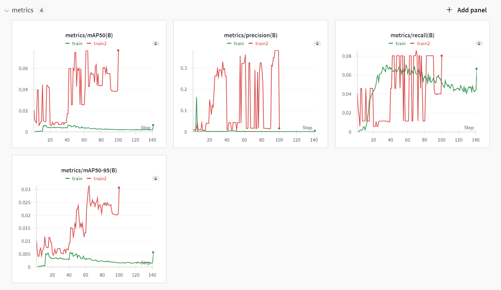
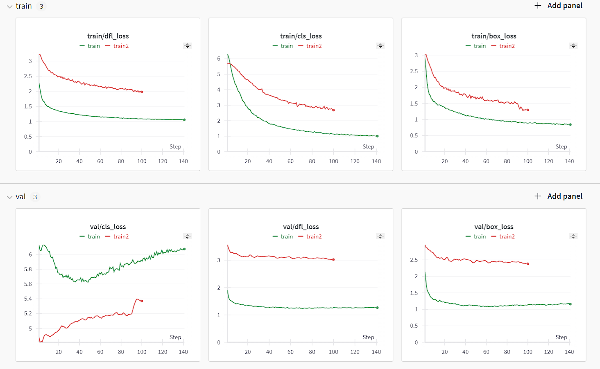

# Auto-Annotation-Engine-with-Florence2

## Overview

This project aims to develop an automated annotation pipeline for images using advanced machine learning techniques. Inspired by AutoDistill, the project leverages the `microsoft/Florence-2-large` model as the backend to generate annotations efficiently. The pipeline supports image uploads, preprocessing, model loading, auto annotation, saving and loading generated files, and converting annotations into YOLO format. This makes it a versatile tool for various computer vision tasks.

## Features

- **Auto Annotation**: Automatically generates annotations for images using state-of-the-art models.
- **Detailed Captions**: The generated annotation files contain detailed captions of the images.
- **Image Preprocessing**: Processes raw images and applies basic augmentations to enhance data quality.
- **COCO Format Support**: Annotations can be saved in COCO format and then converted to YOLO format.
- **Evaluation Report**: The generated annotations are evaluated using the YOLOv8 model to ensure accuracy. Snapshots of the evaluation results can be found in the `docs/evaluation/` directory.

## Project Structure

The project is divided into multiple stages:

1. **Data Ingestion**:
   - Downloads images and annotations from the COCO dataset.
   - Links:
     - `http://images.cocodataset.org/zips/train2017.zip`
     - `http://images.cocodataset.org/zips/val2017.zip`
     - `http://images.cocodataset.org/zips/test2017.zip`
     - `http://images.cocodataset.org/annotations/annotations_trainval2017.zip`
  
2. **Preprocessing**:
   - Processes raw images and applies basic augmentations to prepare the data for annotation.
   - Converts images into feature vectors using the CLIP model and stores them in a FAISS-based vector database.

3. **Auto Annotation**:
   - Generates detailed annotations for images using the `microsoft/Florence-2-large` model.
   - The annotations include captions and other relevant details.

4. **Annotation Saving**:
   - Saves the generated annotations in COCO and JSON formats.
   - The `AnnotationSaver` class converts custom annotations to the COCO format, including images, annotations, captions, categories, licenses, and keypoints.
  
5. **Conversion to YOLO**:
   - Converts the COCO annotations to YOLO format to meet specific requirements.
      
6. **Evaluation Report**:
   - Evaluates the generated annotations using the YOLOv8 model.
   - Provides precision, recall, and F1-score metrics.
   - Provides train and validation losses and different matrix.
   - Evaluation snapshots can be found in the `docs/evaluation/` directory:
   - 
   - 
   - 
    

## Installation

To set up the project locally, follow these steps:

1. **Clone the Repository**:
   ```bash
   git clone <repository-url>
   cd auto-annotation
   ```

2. **Install Dependencies**:
   - Python Libraries:
     ```bash
     pip install -r requirements.txt
     ```
   - Core Libraries:
     - `numpy==1.24.3`
     - `pandas==2.1.1`
     - `matplotlib==3.8.0`
     - `opencv-python==4.8.0.76`
     - `Pillow==10.0.0`
   - Machine Learning and Deep Learning:
     - `tensorflow==2.15.0`
     - `torch==2.1.2`
     - `torchvision==0.16.2`
     - `transformers==4.33.2`
     - `scikit-learn==1.3.0`
     - `pycocotools==2.0.8`
   - Haggingface and Yolo:
     - `huggingface_hub`
     - `ultralytics`

3. **Download Datasets**:
   - Use the provided links in the Data Ingestion section to download the necessary datasets.

4. **Configuration**:
   - Configure project settings using the `config.yaml` file located in the root directory.
   - Manage configuration files and create necessary directories using `ConfigurationManager`.

## Usage

1. **Data Ingestion**:
   - Run the data ingestion script to download and organize datasets.
   - Example:
     ```bash
     python src/auto_annotation/data_ingestion.py
     ```

2. **Preprocessing**:
   - Preprocess images and apply augmentations.
   - Example:
     ```bash
     python src/auto_annotation/preprocess_and_convert.py
     ```

3. **Auto Annotation**:
   - Generate annotations using the auto annotation model.
   - Example:
     ```bash
     python src/auto_annotation/auto_annotate.py
     ```

4. **Saving Annotations**:
   - Save the generated annotations in the desired format.
   - Example:
     ```bash
     python src/auto_annotation/save_annotations.py
     ```

5. **Conversion to YOLO**:
   - Convert the COCO format annotations to YOLO format.
   - Example:
     ```bash
     python src/auto_annotation/convert_to_yolo.py
     ```

6. **Evaluation**:
   - Evaluate the generated annotations using the YOLOv8 model and review the results.
   - Example:
     ```bash
     python src/auto_annotation/evaluate.py
     ```

## Project Configuration

- `config.yaml`: Contains project configurations including data ingestion settings, paths, and model parameters.
- `ConfigurationManager`: Handles configuration management and directory creation.
- `DataIngestionConfig`: Manages data ingestion configuration using dataclasses.

## Contributing

Contributions are welcome! Please fork this repository and submit a pull request if you have any improvements or new features to add.

## License

This project is licensed under the Apache License 2.0. See the `LICENSE` file for more details.

## Contact
[GitHub Pages](https://pages.github.com/).  (https://www.linkedin.com/in/himankoboruah/)

For any questions or suggestions, feel free to reach out on [LinkedIn](https://www.linkedin.com/in/himankoboruah/).
